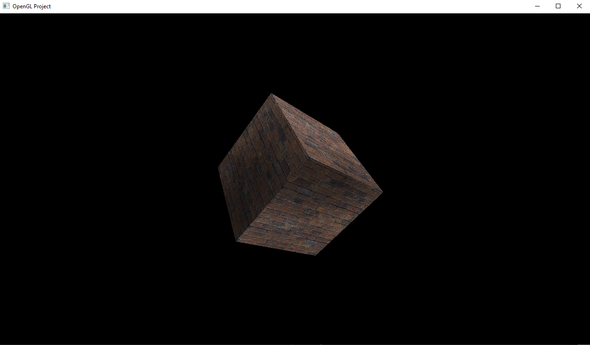

OpenGL Project
==========================================================

Me working with OpenGL.

Credit to [The Cherno][cherno] for help and inspiration

Usage
----------------------------------------------------------

Requires Visual Studio 2019 and nuget to run. Clone the 
project repo and open it in Visual Studio. Run the project
using "Local Windows Debugger" to run the project.

You can of course change the input arguments to the program
using the Project Properties > Debugging Panel.

[cherno]: https://www.youtube.com/watch?v=W3gAzLwfIP0&list=PLlrATfBNZ98foTJPJ_Ev03o2oq3-GGOS2&index=1